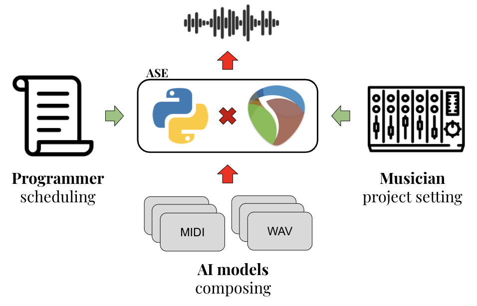

# ReaRender

A python toolkit for automatic audio/MIDI rendering using REAPER

What is REAPER?   
[REAPER](https://www.reaper.fm/) is a DAW providing APIs in pyhton/lua/C++.

## Introduction
For musicians/audio programmers, using DAW (digital audio workstation) for music/audio processing is common nowadays. They can utilize abundant sound effects/plugins and customized settings to achieve their desired sound. 

For AI/ML researchers, especially in MIR/audio fields, they need programmable libraries to process data. However, the quality of accessible ones are usually far from satisfied, comparing to commerical plugins. For example: instrument synthesis (soundfont/fluidsynth v.s. professional-grade virtual instruments, VSTi), sound effects (Sox v.s. VST).

This toolkit brings an alternative solution: musician/audio engineers can customize their setting in DAW as usual, while AI/ML researchers can automate the rendering process to get their desired data.

We hope this toolkit can boost the development in related fields. For example, it can synthesize huge amount of data with high quality, which is beneficial for transcription, source separation, automatic music composition, and etc.

## Meet our AI Composers
Listen to some samples composed by our AI composition model - [REMI](https://github.com/YatingMusic/remi) and rendered by our [ReaRender](https://github.com/YatingMusic/ReaRender) project.

* **Piano solo:** [SoundCloud](https://soundcloud.com/yating_ai/sets/ai-piano-generation-demo-202004)

* **Piano & drums:** [SoundCloud](https://soundcloud.com/yating_ai/sets/ai-pianodrum-generation-demo-202004)   
The drum loops are automatically added by analyzing the structure and grooving of the generated piano track.  

## Requirements
* Python 3
* [REAPER 5.X](https://www.reaper.fm/download-old.php?ver=5x)

## Usage
it’s a bit tricky to get it to run. Therefore, we provide you a few tutorials. See the documents below.

### 1. Install *beyond_reaper*
To controll REAPER in python, you need to install **beyond_reaper**.
Please check out [here](docs/installation.md) for the instructions.

I'm not the author of this awesome package.   
The source is from [here](https://forum.cockos.com/attachment.php?attachmentid=27176&d=1456526708). 
Special thanks to the Reaper community.

### 2. Create Projects
The instruction [here](docs/project_setting.md) will show musicians and engineers how to setup their REAPER project.

### 3. RUN
We have two templates:
* single media - [synth_single_media.py](synth_single_media.py)
* multi media - [synth_multi_media.py](synth_multi_media.py)

Following the structure of the repo and place the media files into these corresponding folders. You can run the programs directly.

## Documentation
1. [Installation](docs/installation.md)
2. [Project Settings](docs/project_setting.md)

## License
MIT License

---
## References
* [ReaScript API](https://www.reaper.fm/sdk/reascript/reascripthelp.html)
* [Reascript API Doc](https://www.extremraym.com/cloud/reascript-doc/#MIDI_GetNote)
