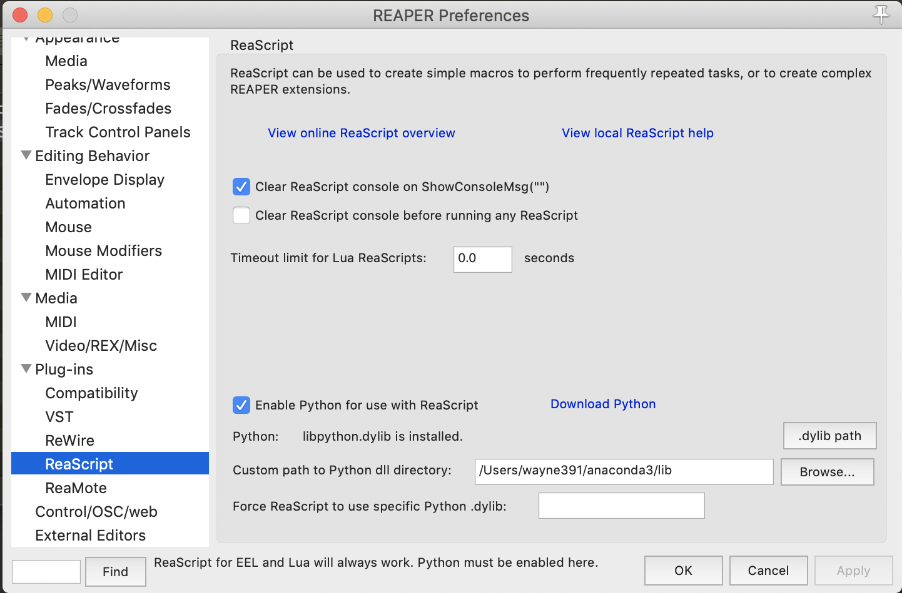
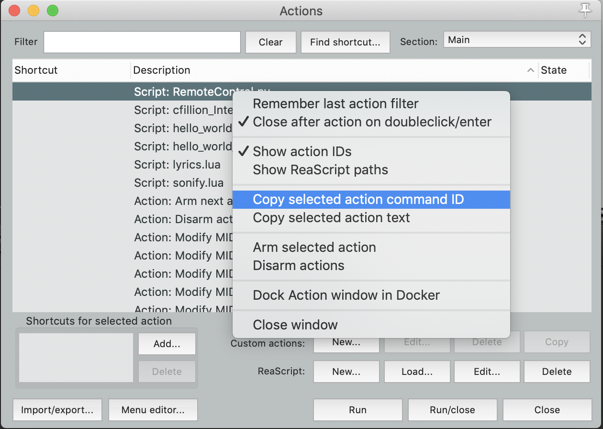
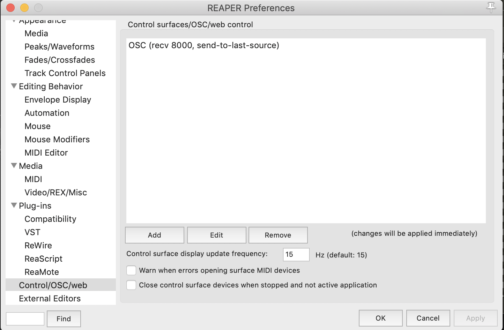
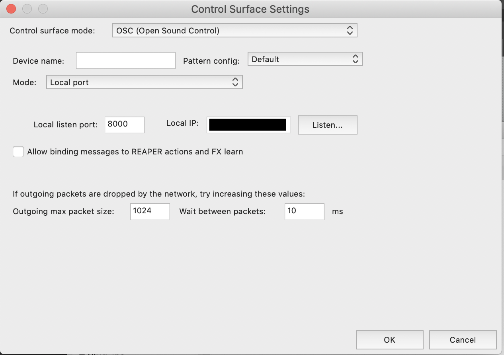
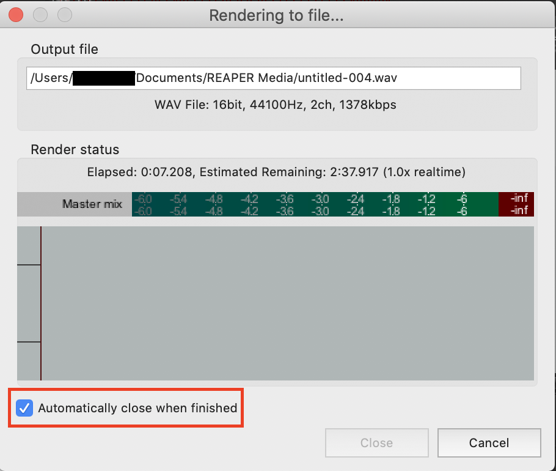

# Instructions for beyond_reaper Installation

This document will show you how to install **beyond_reaper** - a package that can allow users to controll REAPER using python. 

The original source of package is from [here](https://forum.cockos.com/showthread.php?t=129696). The version used here is [V27](https://forum.cockos.com/attachment.php?attachmentid=27176&d=1456526708).

## Requirements
* python 3.4+
* MAC / Windows
* anaconda (recommended)

The document is currently based on MAC. For Windows users, there are just few difference in path or command, so you can keep reading. I will find someday to complete it.

---

## Installation
The instructions is for **MacOS**. For Windows users, there are only a few difference in commands or path setting.


### 1. Unzip the package
Dowanload and unzip the package [beyond_reaper.zip](beyond_reaper.zip) to anywhere you prefer.

Next, you will found there is an original insturctions in the folder: 
```bash
beyond_reaper/Introduction & Installation.txt.
```

The remaining steps are based on it. But I will visualize and explain every steps to make it easier to understand.

### 2. Path Settings
### Edit **beyond.pth** 
enter the full path to the "./Modules" directory on the first line.

### Copy **beyond.pth** to python **site-packages** folder**
First of all, check the current python you are using. Simply type this in your command line:
```bash
$ which python
``` 

Depends on yout environment, the path might be different. But here will show you two common scenarios.


#### 2a. For native python users:  
The output of above command sould be like this:
```bash
/usr/local/bin/python
```

Please copy *beyond.pth* to:
```shell
/usr/local/lib/python3.7/site-packages
# original instruction: <Python Path>/Lib/site-packages
```

#### 2b. For anaconda users
The output of the command sould be like this:
```shell
/Users/username/anaconda3/bin/python
```

Please copy *beyond.pth* to:
```shell
/Users/username/anaconda3/lib/python3.7/site-packages
# original instruction: <Python Path>/Lib/site-packages
```


### 3. Setup REAPER

* Open your REAEPR application 
* Open ```/Modules/beyond/Reaper/Settings.py```

#### 3a. Enable Python for use with ReaScript 
click the checkbox to enable python. For native python users, everything should be done.

If *.dylib* or *.dll* is not found, especially happened in anaconda users, please follow the steps here:

* Find the location of your python *.dylib* or *.dll*. For example, mine is ```/Users/username/anaconda3/lib/libpython3.7m.dylib```
* Unfortunately, REAPER can only recognize ```libpython.dylib``` file. So make a softlink by
```shell
$ ln -s ibpython3.7m.dylib libpython.dylib
```
* Fill the "Custom path to python dll directory" section.
For example, mine is ```/Users/username/anaconda3/lib```, as shown in the figure
* Remeber to click "Apply"



#### 3b. Load RemoteControl Script
Open ```/Modules/beyond/Reaper/Settings.py```, Step 1.

* From Reaper's "Actions/Show action list..." press "ReaScript: Load..."
* Find and select file ```...\Modules\beyond\Reaper\RemoteControl.py```
* Back on the Actions list, you will see "Script: RemoteControl.py"
* Right click on it and select "Copy selected action command ID"
* Paste that to the line here:
```python
# in ...\Modules\beyond\Reaper\RemoteControl.py
Reaper_RemoteControl_CommandID = "_RS..."
```


### 3c. Reaper's OSC and Addresses
Open ```/Modules/beyond/Reaper/Settings.py```, Step 2.

* From Reaper's "Options/Preferences" select "Control/OSC/web" page.
* Press "Add" and select "OSC (Open Sound Control)".
* Make sure the "Pattern config:" is set to Default.
* Select "Mode" to local "port"




#### 3d. Set python executable for REAPER
Open ```/Modules/beyond/Reaper/Settings.py```, Step 3.

Again, check the current location of python by typing:
```bash
$ which python
``` 
Paste it to the line:
```python
# native python
Python = r"C:\Program Files\Python\python.exe"  

# anaconda
Python = r"/Users/username/anaconda3/bin/python"
```

## Have Fun
Finally, we are here. But there are some minor settings you need to pay attentions:

* Click "Automatically close when finished", or it will block your process.

)

* Timeout setting
In ```/Modules/beyond/Network.py```, there is a variable named TimeOut. If you have a file consuming lots of time, you could make it longer.

* [pytautogui](https://pyautogui.readthedocs.io/en/latest/install.html) is your best good friend. If there are dialogue windows blocking your program, just use the package to simulate human's behavior - click next!

* The detailed instructions of setting for the musicians and engneers, please visit [project_setting.md](project_setting.md).

