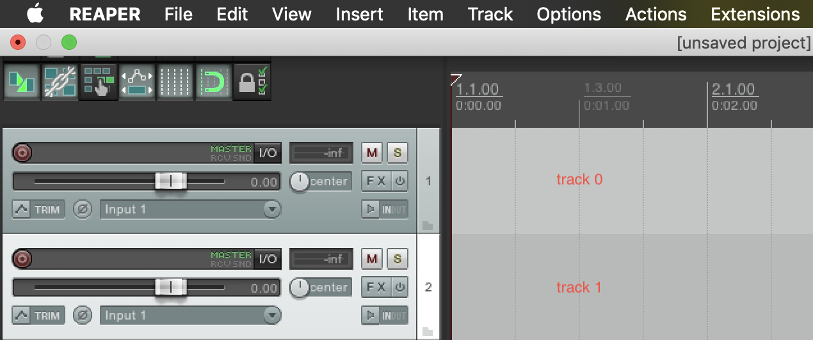
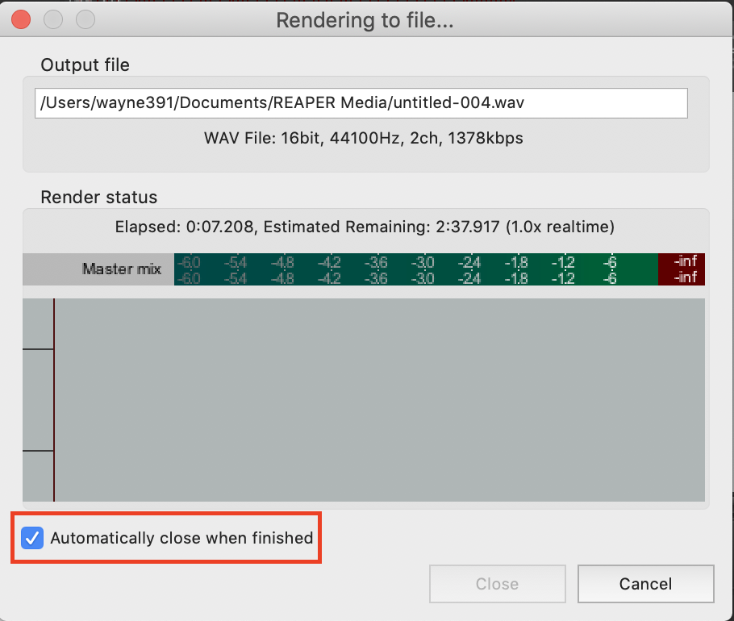

# Instructions for Project Settings

This tutorial will show you how to write python scripts to control REAPER. If you haven't install **beyond_reaper**, please refer to the [installatoin tutorial](installation.md).

## Setupt a REAPER project
* You can insert media items according to the track index. For each track, you can set its own VSTi or VST.


* Before running the program, checkout all rendering settings and ensure that you've click "save changes and close" or at least rendered the project once. Becuase the command I use is using last rendering setting.



## Sample Codes
There are two examples:
*  Synthesize single-track MIDI files: [synth_single_media.py](../synth_single_media.py):  
    * input: ```data/single_media/midi/*.midi```
    * output: ```data/single_media/audio/*.wav```
* Rendering two-track project: [synth_multi_media.py](../synth_multi_media.py): 
    * input: 
        * midi:  ```data/multi_media/m.midi```
        * audio: ```data/multi_media/a.mp3```
    * output: ```data/multi_media/synth_out.wav```

All examples MIDI files are generated by [REMI](https://github.com/YatingMusic/remi).

## Hacks


### A. Dialogue windows
Use [pyautogui](https://pyautogui.readthedocs.io/en/latest/install.html) to simulate human behaviors. It can solve almost everything. Note that in some situations, you need to run simulation commands in parallel threads, or it will block your progeam.


### B. The program is slowing down
After rendering many songs, the porgram will slow down. To solvei it, as shown in ```synth_single_media.py```, I set a timeout to close and reopen the project.
